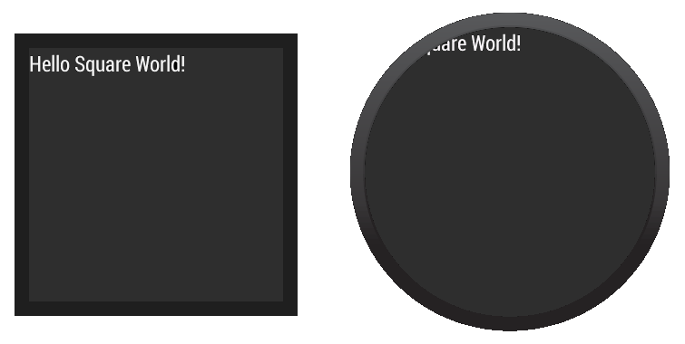
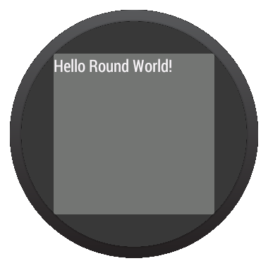
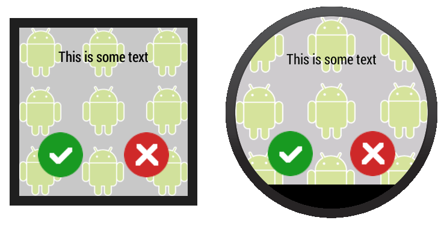

# 定義Layouts

> 編寫: [roya](https://github.com/RoyaAoki) 原文:<https://developer.android.com/training/wearables/ui/layouts.html>

可穿戴設備使用與手持Android設備同樣的佈局技術，但需要有具體的約束來設計。不要以一個手持app的角度開發功能和UI並期待得到一個好的體驗。關於如何設計優秀的可穿戴應用的更多信息，請閱讀[Android Wear Design Guidelines](https://developer.android.com/design/wear/index.html)。

當為Android Wear應用創建layout時，我們需要同時考慮方形和圓形屏幕的設備。在圓形Android Wear設備上所有放置在靠近屏幕邊角的內容可能會被剪裁掉，所以為方形屏幕設計的layouts在圓形設備上不能很好地顯示出來。對這類問題的示範請查看這個視頻[Full Screen Apps for Android Wear](https://www.youtube.com/watch?v=naf_WbtFAlY)。

舉個例子，figure 1展示了下面的layout在圓形和方形屏幕上的效果：



**Figure 1.** 為方形屏幕設計的layouts在圓形設備上不能很好顯示的示範

```xml
<LinearLayout xmlns:android="http://schemas.android.com/apk/res/android"
    xmlns:tools="http://schemas.android.com/tools"
    android:layout_width="match_parent"
    android:layout_height="match_parent"
    android:orientation="vertical">

    <TextView
        android:id="@+id/text"
        android:layout_width="wrap_content"
        android:layout_height="wrap_content"
        android:text="@string/hello_square" />
</LinearLayout>
```

上述範例的文本沒有正確地顯示在圓形屏幕上。

Wearable UI庫為這個問題提供了兩種不同的解決方案：

* 為圓形和方形屏幕定義不同的layouts。我們的app會在運行時檢查設備屏幕形狀並inflate正確的layout。

* 用一個包含在庫裡面的特殊layout同時適配方形和圓形設備。這個layout會在不同形狀的設備屏幕窗口中插入不同的間隔。

當我們希望應用在不同形狀的屏幕上看起來不同時，一般會使用第一種方案。當我們希望用一個相似的layout在兩種屏幕上且在圓形屏幕上沒有視圖被邊緣剪裁時，可以使用第二種方案。

## 添加Wearable UI庫

當我們使用Android Studio的工程嚮導時，Android Studio會自動地在`wear`模塊中包含Wearable UI庫。為了在工程中編譯到這個庫，確保 *Extras > Google Repository* 包已經被安裝在Android SDK manager裡，下面的依賴被包含在`wear`模塊的`build.gradle`文件中：

```xml
dependencies {
    compile fileTree(dir: 'libs', include: ['*.jar'])
    compile 'com.google.android.support:wearable:+'
    compile 'com.google.android.gms:play-services-wearable:+'
}
```

要實現以下的佈局方法需要用到 `'com.google.android.support:wearable'` 依賴。

瀏覽[API reference documentation](https://developer.android.com/reference/android/support/wearable/view/package-summary.html)查看Wearable UI庫的類。

## 為方形和圓形屏幕指定不同的Layouts

包含在Wearable UI庫中的`WatchViewStub`類允許我們為方形和圓形屏幕指定不同的layout。這個類會在運行時檢查屏幕形狀並inflate相應的layout。

為了在我們的應用中使用這個類以應對不同的屏幕形狀，我們需要：

* 添加`WatchViewStub`作為activity的layout的主元素。
* 使用`rectLayout`屬性為方形屏幕指定一個layout文件。
* 使用`roundLayout`屬性為圓形屏幕指定一個layout文件。

類似下面定義activity的layout：

```xml
<android.support.wearable.view.WatchViewStub
    xmlns:android="http://schemas.android.com/apk/res/android"
    xmlns:app="http://schemas.android.com/apk/res-auto"
    xmlns:tools="http://schemas.android.com/tools"
    android:id="@+id/watch_view_stub"
    android:layout_width="match_parent"
    android:layout_height="match_parent"
    app:rectLayout="@layout/rect_activity_wear"
    app:roundLayout="@layout/round_activity_wear">
</android.support.wearable.view.WatchViewStub>
```

在activity中inflate這個layout：

```java
@Override
protected void onCreate(Bundle savedInstanceState) {
    super.onCreate(savedInstanceState);
    setContentView(R.layout.activity_wear);
}
```

然後為方形和圓形屏幕創建不同的layout文件，在這個例子中，我們需要創建`res/layout/rect_activity_wear.xml`和`res/layout/round_activity_wear.xml`兩個文件。像創建手持應用的layouts一樣定義這些layouts，但需要考慮可穿戴設備的限制。系統會在運行時根據屏幕形狀來inflate適合的layout。

### 取得layout views

我們為方形或圓形屏幕定義的layouts在`WatchViewStub`檢測到屏幕形狀之前不會被inflate，所以你的app不能立即取得它們的view。為了取得這些view，需要在我們的activity中設置一個listener，當屏幕適配的layout被inflate時會通知這個listener：

```java
@Override
protected void onCreate(Bundle savedInstanceState) {
    super.onCreate(savedInstanceState);
    setContentView(R.layout.activity_wear);

    WatchViewStub stub = (WatchViewStub) findViewById(R.id.watch_view_stub);
    stub.setOnLayoutInflatedListener(new WatchViewStub.OnLayoutInflatedListener() {
        @Override public void onLayoutInflated(WatchViewStub stub) {
            // Now you can access your views
            TextView tv = (TextView) stub.findViewById(R.id.text);
            ...
        }
    });
}
```

<a name="same-layout"></a>
## 使用感知形狀的Layout

包含在Wearable UI庫中的`BoxInsetLayout`類繼承自 [FrameLayout](https://developer.android.com/reference/android/widget/FrameLayout.html)，該類允許我們定義一個同時適配方形和圓形屏幕的layout。這個類適用於需要根據屏幕形狀插入間隔的情況，並讓我們容易地將view對其到屏幕的邊緣或中心。



**Figure 2.** 在圓形屏幕上的窗口間隔

figure 2中灰色的部分顯示了在應用了窗口間隔之後，`BoxInsetLayout`自動將它的子view放置在圓形屏幕的區域。為了顯示在這個區域內，子view需要用下面這些值指定 `layout_box`屬性：

* 一個`top`、`bottom`、`left`和`right`的組合。比如，`"left|top"`將子view的左和上邊緣定位在figure 2的灰色區域裡面。
* `all`將所有子view的內容定位在figure 2的灰色區域裡面。

在方形屏幕上，窗口間隔為0，`layout_box`屬性會被忽略。



**Figure 3.** 同一個layout工作在方形和圓形屏幕上

在figure 3中展示的layout使用了`BoxInsetLayout`，該layout在圓形和方形屏幕上都可以使用：

```xml
<android.support.wearable.view.BoxInsetLayout
    xmlns:android="http://schemas.android.com/apk/res/android"
    xmlns:app="http://schemas.android.com/apk/res-auto"
    android:background="@drawable/robot_background"
    android:layout_height="match_parent"
    android:layout_width="match_parent"
    android:padding="15dp">

    <FrameLayout
        android:layout_width="match_parent"
        android:layout_height="match_parent"
        android:padding="5dp"
        app:layout_box="all">

        <TextView
            android:gravity="center"
            android:layout_height="wrap_content"
            android:layout_width="match_parent"
            android:text="@string/sometext"
            android:textColor="@color/black" />

        <ImageButton
            android:background="@null"
            android:layout_gravity="bottom|left"
            android:layout_height="50dp"
            android:layout_width="50dp"
            android:src="@drawable/ok" />

        <ImageButton
            android:background="@null"
            android:layout_gravity="bottom|right"
            android:layout_height="50dp"
            android:layout_width="50dp"
            android:src="@drawable/cancel" />
    </FrameLayout>
</android.support.wearable.view.BoxInsetLayout>
```
	
注意layout中的這些部分：

* `android:padding="15dp"`
 
這行指定了`BoxInsetLayout`元素的padding。因為在圓形設備上窗口間隔大於15dp，所以這個padding只應用在方形屏幕上。
  
* `android:padding="5dp"`
 
這行指定內部`FrameLayout`元素的padding。這個padding同時應用在方形和圓形屏幕上。在方形屏幕上，按鈕和窗口間隔總的padding是20dp(15+5)，在圓形屏幕上是5dp。

* `app:layout_box="all"`
 
這行聲明`FrameLayout`和它的子views都被放在圓形屏幕上窗口間隔定義的區域裡。這行在方形屏幕上沒有任何效果。