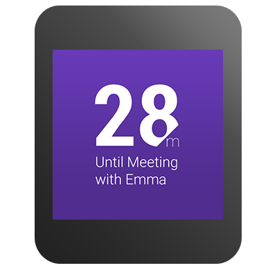

# 設計錶盤

> 編寫:[heray1990](https://github.com/heray1990) - 原文: <http://developer.android.com/training/wearables/watch-faces/designing.html>

類似於設計傳統的錶盤，創建 Android Wear 的錶盤是一個清晰地顯示時間的練習。Android Wear 設備為錶盤提供了高級的功能，我們可以運用這些功能到我們的設計當中，例如鮮豔的色彩、動態的背景、動畫和數據整合。然而，我們必須考慮到很多其它設計上的因素。

這節課總結了設計錶盤需要考慮的因素和通用準則。更多關於這方面的內容，請見 [Watch Faces for Android Wear](http://developer.android.com/design/wear/watchfaces.html) 設計指引。

## 遵守設計準側

當我們設計錶盤的外觀和錶盤需要向用戶表達哪些類型的信息的時候，請考慮一下這些設計準側：

*為方形和圓形的設備作出規劃*

我們的設計應該可以運行在方形和圓形的 Android Wear 設備上，包括那些[使用感知形狀的 Layout](http://hukai.me/android-training-course-in-chinese/wearables/ui/layouts.html#same-layout) 的設備。

*支持所有的顯示模式*

我們的錶盤應該支持有限顏色的環境模式（ambient mode）和全綵色動畫的交互模式（interactive mode）。

*優化特殊屏幕的技術*

在環境模式下，錶盤應該讓大部分像素保持黑色。根據屏幕技術，我們需要避免使用大塊的白像素，僅僅使用黑色和白色，並禁用反鋸齒。

*容納系統 UI 組件*

我們的設計應該確保系統指示圖標可見，當 notification cards 出現在屏幕上的時候用戶還可以看到時間。

*整合數據*

我們的錶盤可以利用配套手機設備上的傳感器和蜂窩數據連接，來顯示相關的上下文數據，例如天氣或者用戶的下一個日程表事件。

*提供設置選項*

我們可以讓用戶配置可穿戴應用或者 Android Wear 配套應用上某些設計特徵（如顏色和尺寸）。

**Figure 1.** 錶盤的例子.

更多關於 Android Wear 錶盤的設計，請見 [Watch Faces for Android Wear](http://developer.android.com/design/wear/watchfaces.html) 設計指引。

## 創建實現策略

完成錶盤的設計後，我們需要決定如何獲得必要的數據和將錶盤繪製到可穿戴設備上。大部分實現方案由如下部分組成：

* 一幅或多幅背景圖片
* 接收需要數據的應用代碼
* 繪製背景圖片上的文本和形狀的應用代碼

我們一般在交互模式和環境模式使用兩幅不同的背景圖片。環境模式下的背景一般是全黑的。Android Wear 設備的屏幕密度（hdpi）應該是 320 x 320 像素，這樣可以同時兼容方形和圓形設備。背景圖片的四角在圓形設備上是不可見的。在我們的代碼中，我們可以檢測到設備屏幕的尺寸。如果設備的分辨率比圖片的低，那麼按比例縮小背景圖片。為了提高性能，我們應該只對背景圖片縮放一次並保存縮放後的 bitmap。

我們應該在需要時運行代碼來檢索上下文數據和保存結果，使得在每次繪製錶盤的時候重用數據。例如，我們不需要每隔一分鐘去刷新一次天氣。

為了增加電池使用時間，在環境模式繪製錶盤的應用代碼應該相對簡單。在環境模式下，我們通常用一組有限的顏色來繪製形狀的輪廓。在交互模式下，我們可以使用全色彩、複雜的形狀、漸變和動畫來繪製錶盤。

後面的課程將會介紹如何詳細地實現錶盤。