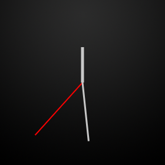

# 繪製錶盤

> 編寫:[heray1990](https://github.com/heray1990) - 原文: <http://developer.android.com/training/wearables/watch-faces/drawing.html>

配置完工程和添加了實現錶盤服務（watch face service）的類之後，我們可以開始編寫初始化和繪製自定義錶盤的代碼了。

這節課通過 Android SDK 中的 *WatchFace* 示例，來介紹系統是如何調用錶盤服務的方法。這個示例位於 `android-sdk/samples/android-21/wearable/WatchFace` 目錄。這裡描述服務實現的很多方面（例如初始化和檢測設備功能）可以應用到任意表盤，所以我們可以重用一些代碼到我們的錶盤當中。



**Figure 1.** *WatchFace* 示例中的模擬和數字表盤

## 初始化錶盤

當系統加載我們的服務時，我們應該分配和初始化錶盤需要的大部分資源，包括加載位圖資源、創建定時器對象來運行自定義動畫、配置顏色風格和執行其他運算。我們通常只執行一次這些操作和重用它們的結果。這個習慣可以提高錶盤的性能並且更容易地維護代碼。

初始化錶盤，需要：

1. 為自定義定時器、圖形對象和其它組件聲明變量。
2. 在 `Engine.onCreate()` 方法中初始化錶盤組件。
3. 在 `Engine.onVisibilityChanged()` 方法中初始化自定義定時器。

下面的部分詳細介紹了上述幾個步驟。

<a name="Variables"></a>
### 聲明變量

當系統加載我們的服務時，我們初始化的那些資源需要在我們實現的不同點都可以被訪問，所以我們可以重用這些資源。我們可以通過在 `WatchFaceService.Engine` 實現中為這些資源聲明成員變量來達到上述目的。

為下面的組件聲明變量：

*圖形對象*

大部分錶盤至少包含一個位圖用於錶盤的背景，如[創建實施策略](designing.html#ImplementationStrategy)描述的一樣。我們可以使用額外的位圖圖像來表示錶盤的時鐘指針或者其它設計元素。

*定時計時器*

當時間變化時，系統每隔一分鐘會通知錶盤一次，但一些錶盤會根據自定義的時間間隔來運行動畫。在這種情況下，我們需要用一個按照所需頻率計數的自定義定時器來刷新錶盤。

*時區變化接收器*

用戶可以在旅遊的時候調整時區，系統會廣播這個事件。我們的服務實現必須註冊一個廣播接收器，該廣播接收器用於接收時區改變或者更新時間的通知。

*WatchFace* 示例中的 `AnalogWatchFaceService.Engine` 類定義了上述變量（見下面的代碼）。自定義定時器實現為一個 [Handler](http://developer.android.com/reference/android/os/Handler.html) 實例，該 Handler 實例使用線程的消息隊列發送和處理延遲的消息。對於這個特定的錶盤，自定義定時器每秒計數一次。當定時器計數，handler 調用 `invalidate()` 方法，然後系統調用 `onDraw()` 方法重新繪製錶盤。

```java
private class Engine extends CanvasWatchFaceService.Engine {
    static final int MSG_UPDATE_TIME = 0;

    /* a time object */
    Time mTime;

    /* device features */
    boolean mLowBitAmbient;

    /* graphic objects */
    Bitmap mBackgroundBitmap;
    Bitmap mBackgroundScaledBitmap;
    Paint mHourPaint;
    Paint mMinutePaint;
    ...

    /* handler to update the time once a second in interactive mode */
    final Handler mUpdateTimeHandler = new Handler() {
        @Override
        public void handleMessage(Message message) {
            switch (message.what) {
                case MSG_UPDATE_TIME:
                    invalidate();
                    if (shouldTimerBeRunning()) {
                        long timeMs = System.currentTimeMillis();
                        long delayMs = INTERACTIVE_UPDATE_RATE_MS
                                - (timeMs % INTERACTIVE_UPDATE_RATE_MS);
                        mUpdateTimeHandler
                            .sendEmptyMessageDelayed(MSG_UPDATE_TIME, delayMs);
                    }
                    break;
            }
        }
    };

    /* receiver to update the time zone */
    final BroadcastReceiver mTimeZoneReceiver = new BroadcastReceiver() {
        @Override
        public void onReceive(Context context, Intent intent) {
            mTime.clear(intent.getStringExtra("time-zone"));
            mTime.setToNow();
        }
    };

    /* service methods (see other sections) */
    ...
}
```

### 初始化錶盤組件

在為位圖資源、色彩風格和其它每次重新繪製錶盤都會重用的組件聲明成員變量之後，在系統加載服務時初始化這些組件。只初始化這些組件一次，然後重用它們以提升性能和電池使用時間。

在 `Engine.onCreate()` 方法中，初始化下面的組件：

* 加載背景圖片。
* 創建風格和色彩來繪製圖形對象。
* 分配一個對象來保存時間。
* 配置系統 UI。

在 `AnalogWatchFaceService` 類的 `Engine.onCreate()` 方法初始化這些組件的代碼如下：

```java
@Override
public void onCreate(SurfaceHolder holder) {
    super.onCreate(holder);

    /* configure the system UI (see next section) */
    ...

    /* load the background image */
    Resources resources = AnalogWatchFaceService.this.getResources();
    Drawable backgroundDrawable = resources.getDrawable(R.drawable.bg);
    mBackgroundBitmap = ((BitmapDrawable) backgroundDrawable).getBitmap();

    /* create graphic styles */
    mHourPaint = new Paint();
    mHourPaint.setARGB(255, 200, 200, 200);
    mHourPaint.setStrokeWidth(5.0f);
    mHourPaint.setAntiAlias(true);
    mHourPaint.setStrokeCap(Paint.Cap.ROUND);
    ...

    /* allocate an object to hold the time */
    mTime = new Time();
}
```

當系統初始化錶盤時，只會加載背景位圖一次。圖形風格被 [Paint](http://developer.android.com/reference/android/graphics/Paint.html) 類實例化。然後我們在 `Engine.onDraw()` 方法中使用這些風格來繪製錶盤的組件，如[繪製錶盤](drawing.html#Drawing)描述的那樣。

<a name="Timer"></a>
### 初始化自定義定時器

作為錶盤開發者，我們通過使定時器按照要求的頻率計數，來決定設備在交互模式時多久更新一次錶盤。這使得我們可以創建自定義的動畫和其它視覺效果。

> **Note:** 在環境模式下，系統不會可靠地調用自定義定時器。關於在環境模式下更新錶盤的內容，請看[在環境模式下更新錶盤](drawing.html#TimeTick)。

在[聲明變量](drawing.html#Variables)部分介紹了一個 `AnalogWatchFaceService` 類定義的每秒計數一次的定時器例子。在 `Engine.onVisibilityChanged()` 方法裡，如果滿足如下兩個條件，則啟動自定義定時器：

* 錶盤可見的。
* 設備處於交互模式。

如果有必要，`AnalogWatchFaceService` 會調度下一個定時器進行計數：

```java
private void updateTimer() {
    mUpdateTimeHandler.removeMessages(MSG_UPDATE_TIME);
    if (shouldTimerBeRunning()) {
        mUpdateTimeHandler.sendEmptyMessage(MSG_UPDATE_TIME);
    }
}

private boolean shouldTimerBeRunning() {
    return isVisible() && !isInAmbientMode();
}
```

該自定義定時器每秒計數一次，如[聲明變量](drawing.html#Variables)介紹的一樣。

在 `Engine.onVisibilityChanged()` 方法中，按要求啟動定時器併為時區的變化註冊接收器：

```java
@Override
public void onVisibilityChanged(boolean visible) {
    super.onVisibilityChanged(visible);

    if (visible) {
        registerReceiver();

        // Update time zone in case it changed while we weren't visible.
        mTime.clear(TimeZone.getDefault().getID());
        mTime.setToNow();
    } else {
        unregisterReceiver();
    }

    // Whether the timer should be running depends on whether we're visible and
    // whether we're in ambient mode), so we may need to start or stop the timer
    updateTimer();
}
```

當錶盤可見時，`onVisibilityChanged()` 方法為時區變化註冊了接收器，並且如果設備在交互模式，則啟動自定義定時器。當錶盤不可見，這個方法停止自定義定時器並且註銷檢測時區變化的接收器。下面是`registerReceiver()` 和 `unregisterReceiver()` 方法的實現：

```java
private void registerReceiver() {
    if (mRegisteredTimeZoneReceiver) {
        return;
    }
    mRegisteredTimeZoneReceiver = true;
    IntentFilter filter = new IntentFilter(Intent.ACTION_TIMEZONE_CHANGED);
    AnalogWatchFaceService.this.registerReceiver(mTimeZoneReceiver, filter);
}

private void unregisterReceiver() {
    if (!mRegisteredTimeZoneReceiver) {
        return;
    }
    mRegisteredTimeZoneReceiver = false;
    AnalogWatchFaceService.this.unregisterReceiver(mTimeZoneReceiver);
}
```

<a name="TimeTick"></a>
### 在環境模式下更新錶盤

在環境模式下，系統每分鐘調用一次 `Engine.onTimeTick()` 方法。通常在這種模式下，每分鐘更新一次錶盤已經足夠了。為了在環境模式下更新錶盤，我們必須使用一個在[初始化自定義定時器](drawing.html#Timer)介紹的自定義定時器。

在環境模式下，大部分錶盤實現在 `Engine.onTimeTick()` 方法中簡單地銷燬畫布來重新繪製錶盤：

```java
@Override
public void onTimeTick() {
    super.onTimeTick();

    invalidate();
}
```

<a name="SystemUI"></a>
## 配置系統 UI

錶盤不應該干涉系統 UI 組件，在 [Accommodate System UI Element](http://developer.android.com/design/wear/watchfaces.html#SystemUI) 中有介紹。如果我們的錶盤背景比較亮或者在屏幕的底部附近顯示了信息，那麼我們可能要配置 notification cards 的尺寸或者啟用背景保護。

當錶盤在動的時候，Android Wear 允許我們配置系統 UI 的下面幾個方面：

* 指定第一個 notification card 離屏幕有多遠。
* 指定系統是否將時間繪製在錶盤上。
* 在環境模式下，顯示或者隱藏 notification card。
* 用純色背景保護系統指針。
* 指定系統指針的位置。

為了配置這些方面的系統 UI，需要創建一個 `WatchFaceStyle` 實例並且將其傳進 `Engine.setWatchFaceStyle()` 方法。

下面是 `AnalogWatchFaceService` 類配置系統 UI 的方法：

```java
@Override
public void onCreate(SurfaceHolder holder) {
    super.onCreate(holder);

    /* configure the system UI */
    setWatchFaceStyle(new WatchFaceStyle.Builder(AnalogWatchFaceService.this)
            .setCardPeekMode(WatchFaceStyle.PEEK_MODE_SHORT)
            .setBackgroundVisibility(WatchFaceStyle
                                    .BACKGROUND_VISIBILITY_INTERRUPTIVE)
            .setShowSystemUiTime(false)
            .build());
    ...
}
```

上述的代碼將 card 配置成一行高，card 的背景只會簡單地顯示和只用於中斷的 notification，不會顯示系統時間（因為錶盤會繪製自己的時間）。

我們可以在錶盤實現的任意時刻配置系統的 UI 風格。例如，如果用戶選擇了白色背景，我們可以為系統指針添加背景保護。

更多關於配置系統 UI 的內容，請見 `WatchFaceStyle` 類的 API 參考文檔。

## 獲得設備屏幕信息

當系統確定了設備屏幕的屬性時，系統會調用 `Engine.onPropertiesChanged()` 方法，例如設備是否使用低比特率的環境模式和屏幕是否需要燒燬保護。

下面的代碼介紹如何獲得這些屬性：

```java
@Override
public void onPropertiesChanged(Bundle properties) {
    super.onPropertiesChanged(properties);
    mLowBitAmbient = properties.getBoolean(PROPERTY_LOW_BIT_AMBIENT, false);
    mBurnInProtection = properties.getBoolean(PROPERTY_BURN_IN_PROTECTION,
            false);
}
```

當繪製錶盤時，我們應該考慮這些設備屬性。

* 對於使用低比特率環境模式的設備，屏幕在環境模式下為每種顏色提供更少的比特，所以當設備切換到環境模式時，我們應該禁用抗鋸齒和位圖濾鏡。
* 對於要求燒燬保護的設備，在環境模式下避免使用大塊的白色像素，並且不要將內容放在離屏幕邊緣 10 個像素範圍內，因為系統會週期地改變內容以避免像素燒燬。

更多關於低比特率環境模式和燒燬保護的內容，請見 [Optimize for Special Screens](http://developer.android.com/design/wear/watchfaces.html#SpecialScreens)。更多關於如何禁用位圖濾鏡的內容，請見[位圖濾鏡](performance.html#BitmapFiltering)

## 響應兩種模式間的變化

當設備在環境模式和交互模式之間轉換時，系統會調用 `Engine.onAmbientModeChanged()` 方法。我們的服務實現應該對在兩種模式間切換作出必要的調整，然後調用 `invalidate()` 方法來重新繪製錶盤。

下面的代碼介紹了這個方法如何在 *WatchFace* 示例的 `AnalogWatchFaceService` 類中實現：

```java
@Override
public void onAmbientModeChanged(boolean inAmbientMode) {

    super.onAmbientModeChanged(inAmbientMode);

    if (mLowBitAmbient) {
        boolean antiAlias = !inAmbientMode;
        mHourPaint.setAntiAlias(antiAlias);
        mMinutePaint.setAntiAlias(antiAlias);
        mSecondPaint.setAntiAlias(antiAlias);
        mTickPaint.setAntiAlias(antiAlias);
    }
    invalidate();
    updateTimer();
}
```

這個例子對一些圖形風格做出了調整和銷燬畫布，使得系統可以重新繪製錶盤。

<a name="Drawing"></a>
## 繪製錶盤

繪製自定義的錶盤，系統調用帶有 [Canvas](http://developer.android.com/reference/android/graphics/Canvas.html) 實例和繪製錶盤所在的 bounds 兩個參數的 `Engine.onDraw()` 方法。bounds 參數說明任意內插的區域，如一些圓形設備底部的“下巴”。我們可以像下面介紹的一樣來使用畫布繪製錶盤：

1. 如果是首次調用 `onDraw()` 方法，縮放背景來匹配它。
2. 檢查設備處於環境模式還是交互模式。
3. 處理任何圖形計算。
4. 在畫布上繪製背景位圖。
5. 使用 [Canvas](http://developer.android.com/reference/android/graphics/Canvas.html) 類中的方法繪製錶盤。

在 *WatchFace* 示例中的 `AnalogWatchFaceService` 類按照如下這些步驟來實現 `onDraw()` 方法：

```java
@Override
public void onDraw(Canvas canvas, Rect bounds) {
    // Update the time
    mTime.setToNow();

    int width = bounds.width();
    int height = bounds.height();

    // Draw the background, scaled to fit.
    if (mBackgroundScaledBitmap == null
        || mBackgroundScaledBitmap.getWidth() != width
        || mBackgroundScaledBitmap.getHeight() != height) {
        mBackgroundScaledBitmap = Bitmap.createScaledBitmap(mBackgroundBitmap,
                                         width, height, true /* filter */);
    }
    canvas.drawBitmap(mBackgroundScaledBitmap, 0, 0, null);

    // Find the center. Ignore the window insets so that, on round watches
    // with a "chin", the watch face is centered on the entire screen, not
    // just the usable portion.
    float centerX = width / 2f;
    float centerY = height / 2f;

    // Compute rotations and lengths for the clock hands.
    float secRot = mTime.second / 30f * (float) Math.PI;
    int minutes = mTime.minute;
    float minRot = minutes / 30f * (float) Math.PI;
    float hrRot = ((mTime.hour + (minutes / 60f)) / 6f ) * (float) Math.PI;

    float secLength = centerX - 20;
    float minLength = centerX - 40;
    float hrLength = centerX - 80;

    // Only draw the second hand in interactive mode.
    if (!isInAmbientMode()) {
        float secX = (float) Math.sin(secRot) * secLength;
        float secY = (float) -Math.cos(secRot) * secLength;
        canvas.drawLine(centerX, centerY, centerX + secX, centerY +
                        secY, mSecondPaint);
    }

    // Draw the minute and hour hands.
    float minX = (float) Math.sin(minRot) * minLength;
    float minY = (float) -Math.cos(minRot) * minLength;
    canvas.drawLine(centerX, centerY, centerX + minX, centerY + minY,
                    mMinutePaint);
    float hrX = (float) Math.sin(hrRot) * hrLength;
    float hrY = (float) -Math.cos(hrRot) * hrLength;
    canvas.drawLine(centerX, centerY, centerX + hrX, centerY + hrY,
                    mHourPaint);
}
```

這個方法根據現在的時間計算時鐘指針的位置和使用在 `onCreate()` 方法中初始化的圖形風格將時鐘指針繪製在背景位圖之上。其中，秒針只會在交互模式下繪製出來，環境模式不會顯示。

更多的關於用 Canvas 實例繪製的內容，請見 [Canvas and Drawables](http://developer.android.com/guide/topics/graphics/2d-graphics.html)。

在 Android SDK 的 *WatchFace* 示例包括附加的錶盤，我們可以用作如何實現 `onDraw()` 方法的例子。