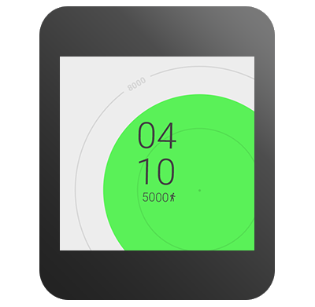
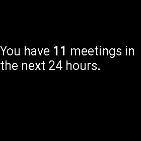

# 在錶盤上顯示信息

> 編寫:[heray1990](https://github.com/heray1990) - 原文: <http://developer.android.com/training/wearables/watch-faces/information.html>

為了顯示時間，Android Wear 設備以 cards、notifications 和其它可穿戴應用的形式向用戶提供相關的信息。創建自定義錶盤不僅可以以豐富的方式顯示時間，還可以在用戶掃視設備的時候顯示相關的信息。

像其它可穿戴應用一樣，我們的錶盤可以通過[可穿戴數據層 API](http://hukai.me/android-training-course-in-chinese/wearables/data-layer/index.html) 與可穿戴設備上的應用通信。某些情況下，我們需要在工程中的手持式應用模塊裡創建一個 activity，該 activity 從互聯網或者用戶的配置文件中檢索數據，然後將數據分享給錶盤。



**Figure 1.** 錶盤集成數據的例子

## 創建豐富的體驗

在設計和實現上下文感知的錶盤前，先回答下面幾個問題：

* 我們想要包含什麼類型的數據？
* 我們可以從哪裡獲得數據？
* 數據多久會顯著變化？
* 如何表達數據，使得用戶瞥一眼就明白其中的意思？

Android Wear 設備通常與一個帶有 GPS 或者蜂窩數據連接的配套設備配對，所以我們有無限的可能來整合不同數據到錶盤中，例如位置、日曆事件、社交媒體、圖片、股票市場報價、新聞事件體育得分等等。然而，並不是所有類型的數據都適合錶盤，所以我們需要考慮哪種類型的數據與用戶最相關。當可穿戴沒有配對的設備或者互聯網連接斷開時，錶盤應該優雅地處理這些情況。

Android Wear 設備上活動的錶盤是一個一直在運行的應用，所以我們必須使用高效節能的方法來獲取數據。例如，我們每隔10分鐘而不是每隔1分鐘去獲取當前的天氣然後將結果保存到本地。當設備從環境模式切換到交互模式時，我們可以刷新上下文數據。這是因為在切換到交互模式時，用戶很可能想瞥一眼手錶。

由於屏幕的空間有限，並且用戶看手錶也只是一次看一兩秒，所以我們應該在錶盤上面將上下文信息歸納起來。有時表達上下文信息最好的方法是用圖形和顏色來反應。例如，錶盤可以根據當前的天氣改變自身的背景圖片。

## 添加數據到錶盤

Android SDK 中的 *WatchFace* 示例展示瞭如何在 `CalendarWatchFaceService` 類裡從用戶的配置文件中獲得日程數據，然後顯示接下來的24小時有多少個會議。這個示例位於 `android-sdk/samples/android-21/wearable/WatchFace` 目錄下。

 

**Figure 2.** 日程表盤

按照下面的步驟實現包含上下文數據的錶盤：

1. 提供一個任務來檢索數據。
2. 創建一個自定義定時器來週期性地調用任務，或者當外部數據變化時通知錶盤服務。
3. 用更新的數據重新繪製錶盤。

下面的內容詳細介紹了上述幾個步驟。

### 提供一個任務來檢索數據

在 `CanvasWatchFaceService.Engine` 實現裡創建一個繼承 [AsyncTask]() 的類。然後添加用於接收我們感興趣的數據的代碼。

下面是 `CalendarWatchFaceService` 類獲取第二天會議數量的代碼：

```java
/* Asynchronous task to load the meetings from the content provider and
 * report the number of meetings back using onMeetingsLoaded() */
private class LoadMeetingsTask extends AsyncTask<Void, Void, Integer> {
    @Override
    protected Integer doInBackground(Void... voids) {
        long begin = System.currentTimeMillis();
        Uri.Builder builder =
                WearableCalendarContract.Instances.CONTENT_URI.buildUpon();
        ContentUris.appendId(builder, begin);
        ContentUris.appendId(builder, begin + DateUtils.DAY_IN_MILLIS);
        final Cursor cursor = getContentResolver() .query(builder.build(),
                null, null, null, null);
        int numMeetings = cursor.getCount();
        if (Log.isLoggable(TAG, Log.VERBOSE)) {
            Log.v(TAG, "Num meetings: " + numMeetings);
        }
        return numMeetings;
    }

    @Override
    protected void onPostExecute(Integer result) {
        /* get the number of meetings and set the next timer tick */
        onMeetingsLoaded(result);
    }
}
```

Wearable Support 庫的 `WearableCalendarContract` 類可以直接存取配套設備用戶的日曆事件。

當任務檢索完數據時，我們的代碼會調用一個回調方法。下面的內容詳細介紹瞭如何實現這個回調方法。

更多關於從日曆獲取數據的內容，請參考 [Calendar Provider](http://developer.android.com/guide/topics/providers/calendar-provider.html) API 指南。

### 創建自定義定時器

我們可以實現一個週期計數的自定義定時器來更新數據。`CalendarWatchFaceService` 類使用一個 [Handler](http://developer.android.com/reference/android/os/Handler.html) 實例通過線程的消息隊列來發送和處理延時的消息：

```java
private class Engine extends CanvasWatchFaceService.Engine {
    ...
    int mNumMeetings;
    private AsyncTask<Void, Void, Integer> mLoadMeetingsTask;

    /* Handler to load the meetings once a minute in interactive mode. */
    final Handler mLoadMeetingsHandler = new Handler() {
        @Override
        public void handleMessage(Message message) {
            switch (message.what) {
                case MSG_LOAD_MEETINGS:
                    cancelLoadMeetingTask();
                    mLoadMeetingsTask = new LoadMeetingsTask();
                    mLoadMeetingsTask.execute();
                    break;
            }
        }
    };
    ...
}
```

當可以看到錶盤時，這個方法初始化了定時器：

```java
@Override
public void onVisibilityChanged(boolean visible) {
    super.onVisibilityChanged(visible);
    if (visible) {
        mLoadMeetingsHandler.sendEmptyMessage(MSG_LOAD_MEETINGS);
    } else {
        mLoadMeetingsHandler.removeMessages(MSG_LOAD_MEETINGS);
        cancelLoadMeetingTask();
    }
}
```

下面的內容介紹在 `onMeetingsLoaded()` 方法設置下一個定時器。

### 用更新的數據重新繪製錶盤

當任務檢索完數據時，調用 `invalidate()` 方法使得系統可以重新繪製錶盤。將數據保存到 `Engine` 類的成員變量，這樣我們就可以在 `onDraw()` 方法中訪問數據。

`CalendarWatchFaceService` 類提供一個回調方法給任務在檢索完日程數據後調用：

```java
private void onMeetingsLoaded(Integer result) {
    if (result != null) {
        mNumMeetings = result;
        invalidate();
    }
    if (isVisible()) {
        mLoadMeetingsHandler.sendEmptyMessageDelayed(
                MSG_LOAD_MEETINGS, LOAD_MEETINGS_DELAY_MS);
    }
}
```

回調方法將結果保存在一個成員變量中，銷燬 view，和調度下一個定時器再次運行任務。