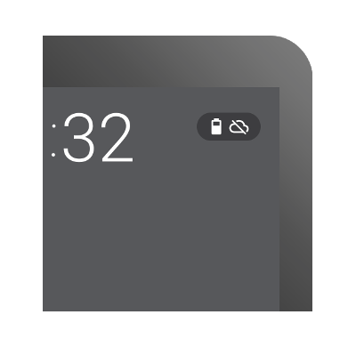

# 定位常見的問題

> 編寫:[heray1990](https://github.com/heray1990) - 原文: <http://developer.android.com/training/wearables/watch-faces/issues.html>

創建 Android Wear 的客製化錶盤與創建 notification 和可穿戴特有的 activity 的方法不同。這幾課介紹如何解決我們在實現第一個錶盤時會遇到的一些問題。

## 檢測屏幕的形狀

一些 Android Wear 設備的屏幕是方形的，另一些是圓形的。圓形屏幕的設備可以在屏幕的底部包含一個插入部分（或者“下巴”）。我們的錶盤應該適應和利用好屏幕特定的形狀，如 [設計指南](http://developer.android.com/design/wear/watchfaces.html) 中的描述。

Android Wear 讓錶盤在運行時決定屏幕的形狀。為了檢測屏幕是方形還是圓形，需要像下面的代碼一樣重寫 `CanvasWatchFaceService.Engine` 類的 `onApplyWindowInsets()` 方法：

```java
private class Engine extends CanvasWatchFaceService.Engine {
    boolean mIsRound;
    int mChinSize;

    @Override
    public void onApplyWindowInsets(WindowInsets insets) {
        super.onApplyWindowInsets(insets);
        mIsRound = insets.isRound();
        mChinSize = insets.getSystemWindowInsetBottom();
    }
    ...
}
```

當重新繪製錶盤時，檢查成員變量 `mIsRound` 和 `mChinSize` 的值來適應我們的設計。

## 容納 Card

當用戶接收到一個 notification，notification card 可能會遮蓋屏幕很大一部分，這取決於[系統 UI 的風格](http://hukai.me/android-training-course-in-chinese/wearables/watch-faces/drawing.html#SystemUI)。錶盤應該適應這些情況，確保當 notification card 出現時用戶仍然可以看到時間。

當 notification card 出現時，模擬錶盤需要調整，如縮小錶盤使得自身不被 card 覆蓋。數字表盤在屏幕顯示時間的區域不會被 card 覆蓋，通常不需要作出調整。使用 `WatchFaceService.getPeekCardPosition()` 方法確定在 card 上方可用於調整錶盤的空間。


**Figure 1.** 當 notification card 出現時，一些模擬錶盤需要調整

在環境模式下，card 的背景是透明的。如果我們的錶盤在環境模式下，card 的附近包含詳細的信息，那麼可以考慮在 card 的上面繪製一個黑色方塊，確保用戶可以讀到 card 的內容。

## 配置系統指示圖標

為了確保系統指示圖標一直可見，當創建一個 `WatchFaceStyle` 實例時，我們可以將配置系統指示圖標在屏幕的位置和決定是否需要背景保護：

* 使用 `setStatusBarGravity()` 方法設置狀態欄的位置。
* 使用 `setHotwordIndicatorGravity()` 方法設置熱詞的位置。
* 使用 `setViewProtection()` 方法，用一個灰色的半透明背景保護狀態欄和熱詞。由於系統指示圖標是白色的，如果我們的錶盤背景是明亮的，這樣做事很必要的。



**Figure 2.** 狀態欄

更多關於系統指示圖標的內容，請查看[配置系統 UI](http://hukai.me/android-training-course-in-chinese/wearables/watch-faces/drawing.html#SystemUI) 和 [設計指南](http://developer.android.com/design/wear/watchfaces.html)。

## 使用相對尺寸

不同廠商的 Android Wear 設備屏幕會有不同的尺寸和分辨率。我們的錶盤應該通過使用相對尺寸而不是絕對像素值來適應這些差異。

當我們繪製錶盤時，用 [Canvas.getWidth()](http://developer.android.com/reference/android/graphics/Canvas.html#getWidth()) 和 [Canvas.getHeight()](http://developer.android.com/reference/android/graphics/Canvas.html#getHeight()) 方法獲得畫布的尺寸，然後以屏幕尺寸一部分所佔比例的值來設置圖片的位置。如果重新繪製錶盤的組件來響應 card，那麼根據屏幕裡 card 上方剩下空間所佔比例的值來重新繪製錶盤。