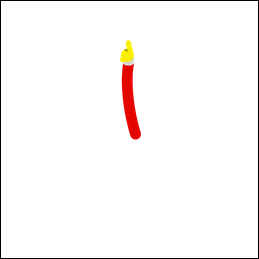

# 優化性能和電池使用時間

> 編寫:[heray1990](https://github.com/heray1990) - 原文: <http://developer.android.com/training/wearables/watch-faces/performance.html>

除了有好的 notification cards 和系統指示圖標之外，我們還需要確保錶盤的動畫運行流暢，服務不會執行沒必要的計算。Android Wear 的錶盤會在設備上一直運行，所以錶盤高效地使用電池顯得十分重要。

這節課提供了一些提示來加快動畫的速度，測量和節省設備上的電量。

## 減小位圖資源的尺寸

很多表盤由一張背景圖片及其它被轉換和覆蓋在背景圖片上面的圖形資源組成，例如時鐘指針和其它隨著時間移動的設計組件。沒詞系統重新繪製錶盤的時候，在 `Engine.onDraw()` 方法裡面，這些圖像組件往往會旋轉（有時會縮放），詳見[繪製錶盤](http://hukai.me/android-training-course-in-chinese/wearables/watch-faces/drawing.html#Drawing)。

這些圖形資源越大，轉換它們所需的運算量就越大。在 `Engine.onDraw()` 方法中轉換大的圖形資源會大大地減低系統運行動畫的幀率。

為了提升錶盤的性能，我們需要：

* 不要使用比我們需要的更大的圖像組件。
* 刪除邊緣周圍多出來的透明像素。

在 Figure 1 中的時鐘指針例子可以將大小減小97%。

**Figure 1.** 可以剪裁多餘像素的時鐘指針

這節內容介紹的減小位圖資源的大小不僅提升了動畫的性能，也節省了電量。

## 合併位圖資源

如果我們有經常需要一起繪製的位圖，那麼可以考慮將它們合併到同一個圖形資源中。在交互模式下，通常我們可以將背景圖片和計數標記組合起來，從而避免沒詞系統重新繪製錶盤時，都去繪製兩個全屏的位圖。

## 當繪製可縮放的位圖時禁用反鋸齒功能

當使用 <a href="http://developer.android.com/reference/android/graphics/Canvas.html#drawBitmap(android.graphics.Bitmap, float, float, android.graphics.Paint)">Canvas.drawBitmap()</a> 方法繪製可縮放的位圖，我們可以使用 [Paint](http://developer.android.com/reference/android/graphics/Paint.html) 實例去設置一些選項。為了提升性能，使用 [setAntiAlias()](http://developer.android.com/reference/android/graphics/Paint.html#setAntiAlias(boolean)) 方法禁用反鋸齒，這是由於這個設置對於位圖沒有任何影響。

### 使用位圖濾鏡

對於繪製在其它組件上的位圖資源，可以在同一個 [Paint](http://developer.android.com/reference/android/graphics/Paint.html) 實例上使用 [setFilterBitmap()](http://developer.android.com/reference/android/graphics/Paint.html#setFilterBitmap(boolean)) 方法來打開位圖濾鏡。Figure 2顯示了使用和沒使用位圖濾鏡的放大的時鐘指針。

 

**Figure 2.** 沒使用位圖濾鏡（左）和使用位圖濾鏡（右）

> **Note:** 在低比特率的環境模式下，系統不能可靠地渲染圖片的顏色，從而不能保證成功地執行位圖濾鏡。因此，在環境模式下，禁用位圖濾鏡。

## 將複雜的操作移到 onDraw() 方法外面

每次重新繪製錶盤時，系統會調用 `Engine.onDraw()` 方法，所以為了提升性能，我們應該只將用於更新錶盤的重要的操作放到這個方法中。

可以的話，避免在 `onDraw()` 方法裡處理下面這些操作：

* 加載圖片和其它資源。
* 調整圖片的大小。
* 分配對象。
* 運行在幀與幀之間不會改變的計算。

通常可以在 `Engine.onCreate()` 方法中運行上述這些操作。我們可以在 執行<a href="http://developer.android.com/reference/android/service/wallpaper/WallpaperService.Engine.html#onSurfaceChanged(android.view.SurfaceHolder, int, int, int)">Engine.onSurfaceChanged()</a> 方法之前調整圖片大小。其中，該方法提供了畫布的大小。

為了分析錶盤的性能，我們可以使用 Android Device Monitor。特別地，確保 `Engine.onDraw()` 實現的運行時間是短的和調用是一致的。詳細內容見[使用 DDMS](http://developer.android.com/tools/debugging/ddms.html)。

## 節能的最佳做法

除了前面部分介紹的技術之外，我們還需要按照下面的最佳做法來降低錶盤的電量消耗。

### 降低動畫的幀頻

動畫通常需要消耗大量計算資源和電量。大部分動畫在每秒30幀的情況下看上去是流暢的，所以我們應該避免動畫的幀頻比每秒30幀高。

### 讓 CPU 睡眠

錶盤的動畫和內容的小變化會喚醒 CPU。錶盤應該在動畫之間讓 CPU 睡眠。例如，在交互模式下，我們可以每隔一秒使用動畫的短脈衝，然後在下一秒讓 CPU 睡眠。頻繁地讓 CPU 睡眠，甚至短暫地，都可以有效地降低電量消耗。

為了最大化電池使用時間，謹慎地使用動畫。即使閃爍動畫在閃爍的時候也會喚醒 CPU 並且消耗電量。

### 監控電量消耗

在 [Android Wear companion app](https://play.google.com/store/apps/details?id=com.google.android.wearable.app&hl=en) 的 **Settings > Watch battery** 下，開發者和用戶可以看到可穿戴設備中不同進程還有多少電量。

在 Android 5.0 中，更多關於提升電池使用時間的信息，請見 [Project Volta](http://developer.android.com/about/versions/android-5.0.html#Power)。